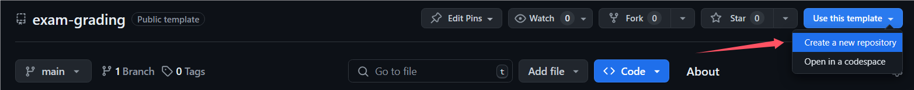
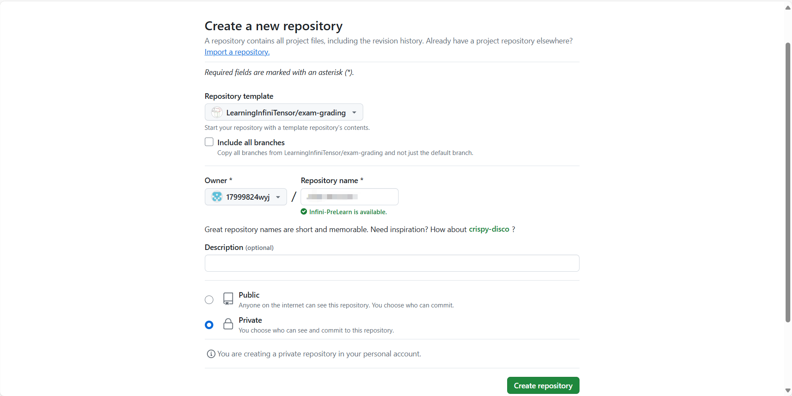

# 下载环境

**注：运行过程中产生的问题请查阅[Q & A](./problem.md)，实在解决不了，再在微信群聊中咨询助教和老师！**

## 本节目录

- [下载环境](#下载环境)
  - [本节目录](#本节目录)
  - [准备 Git 环境](#准备-git-环境)
  - [获取 exam-grading 源码](#获取-exam-grading-源码)

## 准备 Git 环境

Git 的安装可参考：[1.5 起步 - 安装 Git](https://git-scm.com/book/zh/v2/%E8%B5%B7%E6%AD%A5-%E5%AE%89%E8%A3%85-Git) 或 本书[第一章第一节](https://17999824wyj.github.io/InfiniTensor-camp-book-stage0/ch1-01.html)

## 获取 exam-grading 源码

学员需要通过 [exam-grading 模板](https://github.com/LearningInfiniTensor/exam-grading) 创建自己的评分系统仓库：



> **NOTICE** 推荐创建为 private 仓库，自己部分的仓库名可以随便起，如下图：



之后将创建的 exam-grading 仓库拉取到本地

```bash
git clone '打马赛克的那一堆的实际网址' ./exam-grading
cd exam-grading
```

> **NOTICE** 仓库网址打马赛克了，请自行替换，如果不会这么看或者不会拉取，那就复习本书的[第三章第二节](./ch3-02.md#拉取)的对应内容。
