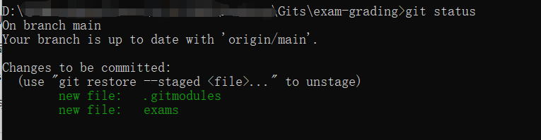
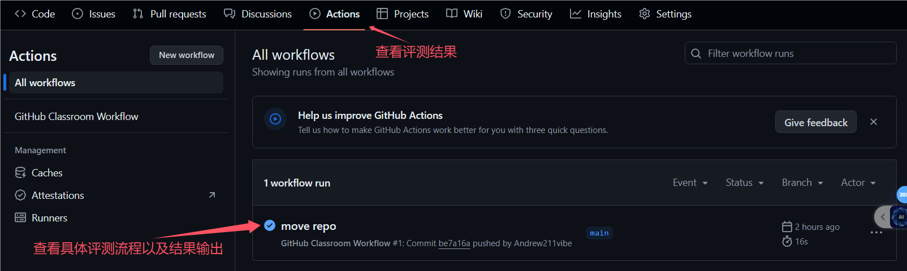
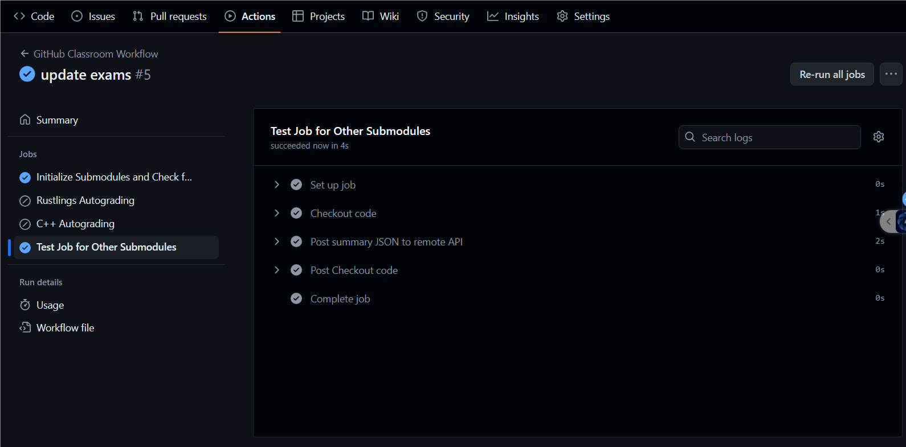

# 实际操作

该部分将通过给评分系统添加 exams 目录以演示测验评分系统的使用方法。

**注：运行过程中产生的问题请查阅[Q & A](./problem.md)，实在解决不了，再在微信群聊中咨询助教和老师！**

**注：推荐使用“子模块”方式，使用此系统。**

首先需要在 Github 上创建一个**测试仓库**（只需包含一个 README 即可），权限设置为 `public`，否则之后测试拉取会因为没有权限而报错找不到仓库。创建好测试仓库之后可通过两种方式添加将该测试仓库添加至评分系统：[直接目录](#通过-直接目录-使用此系统)和[子模块](#通过-子模块-使用此系统)。

## 本节目录

- [实际操作](#实际操作)
  - [本节目录](#本节目录)
  - [通过 "直接目录" 使用此系统](#通过-直接目录-使用此系统)
  - [通过 "子模块" 使用此系统](#通过-子模块-使用此系统)
  - [成功标志](#成功标志)

## 通过 "直接目录" 使用此系统

通过直接目录的方式添加测试目录，需要学员将目标测试目录克隆到评分系统中：

```bash
# 首先进入到exam-grading的项目目录内
cd exam-grading
git clone <target-test-repo> ./exams
cd exams
# 确保为最新
git pull
```

## 通过 "子模块" 使用此系统

子模块方式则只需将对应测试目录以子模块的方式加入评分系统即可：

```bash
# 首先进入到exam-grading的项目目录内
cd exam-grading
# 下面尖括号内的内容，替换为你刚刚新建的那个远程仓库的地址
# 第二个参数，请写死为“exams”！如果没有，那么测试不会运行！
git submodule add <target-test-repo> ./exams
# 确保为最新
git submodule update --remote
# 然后 git add
git add .
```

预期结果如下图，通过 `git status` 查看：


添加测试目录后，学员即可提交更改到远程仓库，评测系统将会自动运行。

通过以下命令提交：

```bash
# add 那步刚刚做完了！
git commit -m "你想提交的信息，一般来说，要符合你所做的实际更改内容，比如增加了什么，完成了什么"
git push
```

运行结果可以在仓库 actions 界面查看：



> **NOTICE** 此处提交的内容为新增的 `exams` 目录，若使用子模块方式还会有一个 `.gitsubmodule` 文件，如果你放置的，是其它名字的目录，那么对应的远程仓库的产物名字也是你改的那个名字。

**注：待测试仓库，请写死为“exams”！如果没有，那么测试不会运行！**

目标运行结果：



## 成功标志

在训练营导学阶段的排行榜中，看到你的名字(如果看不到，可能是你没改个人信息，或者 Actions 运行出错，如果是后者，请去群里联系班主任或助教)。

链接：[https://opencamp.cn/InfiniTensor/camp/2024summer/stage/0?tab=rank](https://opencamp.cn/InfiniTensor/camp/2024summer/stage/0?tab=rank)

**注：在评分一样的情况下，按照时间排序，请自行寻找自己的位置。同时，记得要在你 push 后，等 5 到 10min！**
